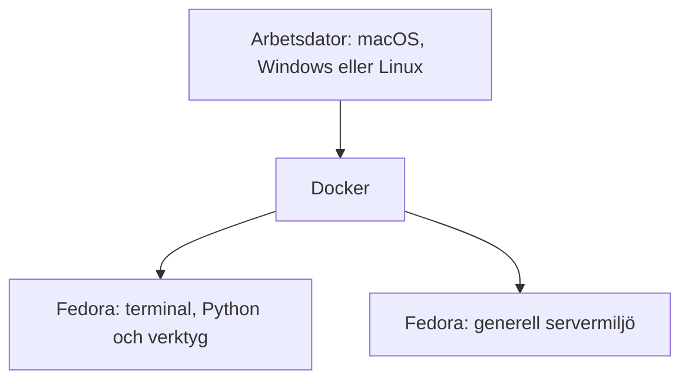
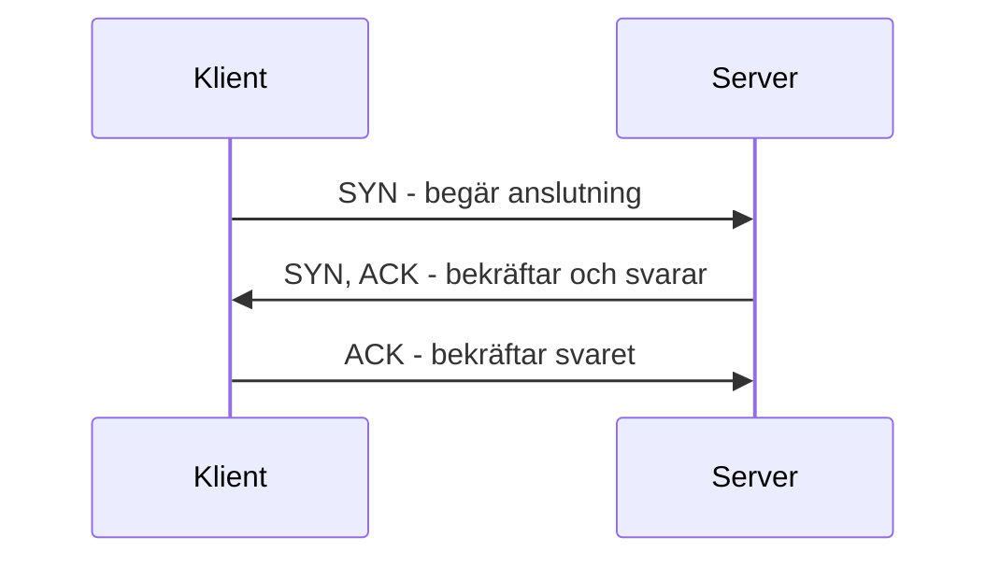

# Grunderna i nätverk, Linux och Python

## Begrepp

Vi använder *scope* för uppdragets avgränsning. En kommandotolk, *shell* läser våra kommandon och startar program. Ett GUI (*Graphical User Interface*) är ett grafiskt användargränssnitt med exempelvis fönster och knappar.

IP (*Internet Protocol*) används för adressering och transport mellan nät. TCP (*Transmission Control Protocol*) och UDP (*User Datagram Protocol*) är två transportprotokoll som vi jämför längre fram. DNS (*Domain Name System*) hjälper oss att slå upp namn. HTTP (*Hypertext Transfer Protocol*) används för webbtrafik och TLS (*Transport Layer Security*) skyddar kommunikationen när vi använder HTTPS.

SSH (*Secure Shell*) ger krypterad fjärråtkomst. SMB (*Server Message Block*) används bland annat för fildelning. Ett API (*Application Programming Interface*) låter program utbyta data. CSV (*Comma-Separated Values*) lagrar tabelldata som text och JSON (*JavaScript Object Notation*) lagrar strukturerade värden. Vi använder båda i Python-labben.

## Introduktion

Vi har gått genom kursens viktigaste regel: inget test utan tillstånd och inget steg utanför scope. Nu behöver vi bygga den tekniska grunden.

När en webbläsare öppnar en webbplats händer flera saker på några få ögonblick. Ett namn översätts till en adress. Data delas upp och transporteras genom nätverk. En anslutning upprättas till en port. Webbservern tar emot en förfrågan och skickar ett svar. En säkerhetstestare behöver kunna dela upp händelsekedjan och fråga: *vilken del fungerar, vilken del svarar och var kan kontrollen brista?*

Vi ska också lära känna kursens arbetsmiljö som ser ut så här:



Vi använder macOS som exempel på arbetsdator. På macOS och Windows kör vi Linux-containrar med Docker Desktop. På Linux kan vi använda Docker Engine. Senaste Fedora är vår terminal- och servermiljö, CentOS Stream är ett alternativ när vi behöver anknytning till Red Hat Enterprise Linux (RHEL). En full virtuell maskin används senare när en container inte räcker. Framför allt för Windows och Active Directory.

Den praktiska delen avslutas med Python. Vi ska inte skriva en scanner ännu. Vi ska i stället göra något som är minst lika viktigt i ett riktigt uppdrag: läsa redan insamlad data, validera den och omvandla den till ett strukturerat underlag för rapportering.

## Från arbetsdator till Linux-container

### Host, image och container

Tre begrepp behöver hållas isär:

Värd, *host*
: Datorn som kör miljön. I exemplen använder vi macOS. Samma containermiljö kan köras från Windows eller Linux.

*Image*
: En skrivskyddad mall med ett filsystem och metadata. `fedora:latest` är exempel på en image-referens.

*Container*
: En körande instans av en image. Flera containrar kan skapas från samma image. När en tillfällig container tas bort försvinner ändringar som inte har sparats utanför den.

> En image är alltså inte en körande maskin, på samma sätt som en installationsfil inte är ett körande program.

### Container kontra virtuell maskin

En virtuell maskin, VM, emulerar en full dator och kör ett eget operativsystem med egen linuxkärna. En Linux-container delar däremot linuxkärna med den Linuxmiljö som Docker Desktop tillhandahåller.

| Egenskap | Container | Virtuell maskin |
|---|---|---|
| Starttid | Vanligen sekunder | Vanligen längre |
| Storlek | Ofta liten | Ofta flera GB |
| Kernel | Delas med containervärden | Egen kernel |
| Systemtjänster/GUI | Begränsat eller saknas | Fullt operativsystem |
| Snapshot/återställning | Ny container från image | Hypervisorns snapshots |
| Passar kursen för | Terminal, Python, verktyg, enkla servrar | AD, Windows, GUI och kernelberoende moment |

Containrar är praktiska, men de är inte en magisk säkerhetsgräns. Docker Desktop, nätverkskopplingar, monterade mappar och containerinställningar avgör vad containern kan nå. Vi behandlar därför våra laborationer som **riskreducerade**, aldrig som riskfria.

### Varför Fedora och CentOS Stream?

Fedora ger en modern miljö med pakethanteraren `dnf`, SELinux och nära koppling till Red Hat-världen. CentOS Stream ligger mellan Fedora och kommande RHEL-versioner och passar som generell serverplattform.

> Kali Linux är användbart när många säkerhetsverktyg behöver finnas färdigpaketerade, men en säkerhetstestare bör förstå sina verktyg och sin plattform. I den här kursen används Kali därför endast när ett särskilt moment motiverar det.

## Förbered Docker på datorn

| Arbetsdator | Miljö | Terminal |
|---|---|---|
| macOS | Docker Desktop | Terminal med zsh |
| Windows | Docker Desktop med WSL 2, Windows Subsystem for Linux | PowerShell |
| Linux | Docker Engine eller Docker Desktop | Bash eller motsvarande kommandotolk |

Vi kontrollerar att datorn uppfyller [Dockers installationskrav](https://docs.docker.com/get-started/get-docker/) och har tillräckligt minne och diskutrymme.

### Kontrollera installationen

Vi öppnar datorns terminal. Följande Docker-kommandon fungerar även i PowerShell.

Vi kontrollerar Docker-klienten och den Docker-server som kör containrarna:

```console
docker version
```

`docker`
: är kommandot som skickar instruktioner till Docker.

`version`
: visar versionsinformation för klienten och servern.

Kommandot visar information om både klient och server när Docker Desktop fungerar. Vi listar sedan containrar som körs:

```console
docker ps
```

`docker ps`
: visar körande containrar. En lista utan containerrader är normal före första starten.

### Hämta kursens basimage

Vi hämtar senaste Fedora:

```console
docker pull fedora:latest
```

`docker pull`
: hämtar en image från ett register.

`fedora:latest`
: anger imagen `fedora` och taggen `latest`, som följer den senaste basimagen.

### Bygg lektionens Fedora-verktygsimage

Den officiella Fedora-imagen är medvetet minimal. Vi antar därför inte att Python eller nätverksverktyg redan finns. Vi skapar filen `Containerfile.tools` i en tom mapp:

```dockerfile
FROM fedora:latest

RUN dnf -y install \
        bind-utils \
        curl \
        iproute \
        iputils \
        less \
        man-db \
        man-pages \
        mtr \
        nmap \
        python3 \
        samba-client \
        traceroute \
    && dnf clean all

CMD ["bash"]
```

Byggfilens delar betyder:

`FROM fedora:latest`
: väljer senaste Fedora som bas.

`RUN`
: kör nästa kommando när imagen byggs.

`dnf -y install`
: använder Fedoras pakethanterare `dnf` för installation. `-y` svarar ja på installationsfrågorna.

`bind-utils`, `curl`, `iproute` och `iputils`
: ger bland annat DNS-verktyget `dig`, webbklienten `curl`, nätverksverktygen `ip` och `ss` samt grundläggande nätverksdiagnostik.

`less`, `man-db`, `man-pages` och `python3`
: installerar textbläddrare, manualvisare, grundläggande manualsidor och distributionens Python 3.

`nmap`, `samba-client` och `traceroute`
: ger kartläggningsverktyget `nmap`, SMB-klienten `smbclient` och vägkartläggaren `traceroute`.

`\`
: fortsätter samma bygginstruktion på nästa rad.

`&& dnf clean all`
: rensar pakethanterarens cache om installationen lyckades. `&&` gör att kommandot efter bara körs om föregående kommando lyckades.

`CMD ["bash"]`
: anger kommandotolken `bash` som standardprocess när containern startar.

Vi bygger verktygsmiljön från byggfilen:

```console
docker build --pull -t fedora-tools:local -f Containerfile.tools .
```

`docker build`
: bygger en image.

`--pull`
: kontrollerar om en ny basimage finns att hämta.

`-t fedora-tools:local`
: ger bygget namnet `fedora-tools` och taggen `local`.

`-f Containerfile.tools`
: väljer byggfil.

`.`
: använder aktuell katalog som bas, det vill säga de filer bygget får tillgång till.

`--pull` ser till att den angivna basimagen kontrolleras vid bygget.

### Starta en tillfällig Fedora-container

Vi startar vår första tillfälliga container:

```console
docker run --rm -it --name eh-fedora fedora-tools:local
```

`docker run`
: skapar och startar containern.

`--rm`
: tar bort containern när huvudprocessen avslutas.

`-i`
: håller standardindata öppen så att vi kan skriva till processen.

`-t`
: skapar en terminal. Vi kombinerar flaggorna som `-it`.

`--name eh-fedora`
: ger containern namnet `eh-fedora`.

`fedora-tools:local`
: väljer vår lokala image. Dess standardprocess är kommandotolken `bash`, enligt `CMD` i vårt Containerfile.

Prompten ändras när vi befinner oss i containern. Vi kontrollerar distribution, användare och arbetskatalog inifrån containern:

```console
cat /etc/os-release
whoami
pwd
```

`cat /etc/os-release`
: skriver ut filen `/etc/os-release`, där distributionen beskriver sig själv.

`whoami`
: visar namnet på den användare vi kör som.

`pwd`
: visar den aktuella arbetskatalogens fullständiga sökväg.

Vi lämnar containerns kommandotolk:

```console
exit
```

`exit`
: avslutar kommandotolken. När huvudprocessen avslutas stannar containern.

Eftersom `--rm` användes tas containern bort. Miljön blir reproducerbar och lämnar inte gamla ändringar efter sig.

### Säkerhetsregler för kursens containrar

Vi använder aldrig följande utan en särskild anledning:

- `--privileged`
- `--network host`
- montering av Docker-socketen
- montering av hela `C:\`, användarprofilen eller känsliga mappar
- publicering av sårbara tjänster på alla nätverksinterface

> Vi monterar endast en särskild mapp. Vi lägger aldrig riktiga lösenord, SSH-nycklar eller kunddata där.

## Linuxterminalen från grunden

Linux skiljer mellan stora och små bokstäver. `Rapport.txt` och `rapport.txt` är två olika namn. Sökvägar använder `/` och rotkatalogen skrivs `/`.

### Var befinner vi oss?

Vi tar reda på vilken katalog vi arbetar i:

```console
pwd
```

`pwd`
: skriver ut arbetskatalogens fullständiga sökväg.

`pwd` betyder *print working directory*.

### Vad finns här?

Vi listar först namnen i katalogen och sedan en mer detaljerad lista:

```console
ls
ls -la
```

`ls`
: listar kataloginnehållet.

`-la`
: kombinerar `-l` för detaljerad lista med `-a` för att även visa dolda namn.

Dolda filer börjar normalt med punkt.

### Byt katalog

Vi övar på att byta arbetskatalog:

```console
cd /etc
cd ..
cd /
```

`cd`
: byter arbetskatalog.

`/etc`
: är katalogen där många systeminställningar finns.

`..`
: betyder katalogen ett steg ovanför den aktuella.

`/`
: är filsystemets rotkatalog.

### Läs text

Vi jämför tre sätt att läsa textfiler:

```console
cat /etc/os-release
head /etc/services
less /etc/services
```

`cat`
: skriver ut hela filen efter kommandot.

`/etc/os-release`
: innehåller uppgifter om distributionen.

`head`
: visar normalt de första tio raderna.

`/etc/services`
: innehåller kända tjänstenamn och deras portnummer. *Filen visar inte vad som faktiskt körs.*

`less`
: öppnar text i en bläddrare i terminalen. Vi avslutar med tangenten `q`.

### Sök i text

Vi söker efter rader som nämner SSH:

```console
grep -i ssh /etc/services
```

`grep`
: söker efter ett textmönster.

`-i`
: ignorerar skillnaden mellan stora och små bokstäver.

`ssh`
: är textmönstret vi söker efter.

`/etc/services`
: är filen som genomsöks.

### Få hjälp

Vi läser hjälptext och manualsida för `ls`:

```console
ls --help
man ls
```

`ls --help`
: visar en kort hjälptext. Flaggan `--help` begär hjälp.

`man ls`
: öppnar manualsidan för `ls`, `man` är manualen. Vi avslutar med `q`.

Alla linuxsystem och containrar har inte manualsidor installerade. `--help` är därför ofta första steget.

### Root i en container

I en container är användaren ofta `root`. Det betyder inte automatiskt administratör på datorn, men användaren har stora rättigheter i containern. Felaktiga mounts eller farliga Docker-inställningar kan göra detta betydligt allvarligare.

Vi frågar alltid:

1. Vilken användare kör processen?
2. Vilka filer är monterade från värden?
3. Vilket nätverk kan containern nå?
4. Vilka capabilities har den fått?

## Nätverket som lager

För att förstå säkerhetstestning behöver vi kunna följa kommunikationen från namn till applikation.

### Klient och server

En **klient** initierar vanligen en förfrågan. En **server** väntar på förfrågningar och erbjuder en tjänst. Roller beror på sammanhanget: samma dator kan vara klient i en kommunikation och server i en annan.

När webbläsaren hämtar en sida är webbläsaren HTTP-klient och webbservern HTTP-server.

### Protokoll

Ett protokoll är en uppsättning regler för kommunikation. Några exempel:

| Protokoll | Huvuduppgift | Vanlig transport |
|---|---|---|
| DNS | Översätta namn och annan domändata | UDP och TCP |
| HTTP | Förfrågningar och svar för webb/API | TCP. Modern HTTP kan även använda QUIC/UDP |
| HTTPS | HTTP skyddat med TLS | TCP eller QUIC/UDP beroende på version |
| SSH | Krypterad fjärrterminal och överföring | TCP |
| SMB | Fil- och resursdelning | TCP |

Portnummer är konventioner, inte garantier. En tjänst på port 443 är ofta HTTPS, men vi behöver fortfarande identifiera vad som faktiskt svarar.

### IP-adress

En IP-adress identifierar ett nätverksinterface i ett IP-nät. IPv4 skrivs exempelvis:

```text
192.168.50.10
```

IPv6 kan skrivas:

```text
2001:db8:50::10
```

`2001:db8::/32` är reserverat för dokumentation och används här som exempel.

### Subnät och CIDR

CIDR (*Classless Inter-Domain Routing*) beskriver ett nät och dess prefix. Exempel:

```text
192.168.50.0/24
```

För en nybörjare räcker det att förstå att `/24` anger vilka bitar som beskriver nätet. Nätet innehåller adresser från `192.168.50.0` till `192.168.50.255`, men alla adresser används inte nödvändigtvis som vanliga värdadresser.

Scope anges ofta i CIDR. Ett skrivfel kan därför ge ett mycket större målområde än avsett. Validering före skanning är ett säkerhetskrav.

### ARP: från IP-adress till nätverkskort

En IP-adress räcker inte för att skicka data i det lokala nätet. Datorn behöver också veta vilket nätverkskort adressen hör till, det vill säga kortets fysiska adress eller *MAC-adress*. MAC står för *Media Access Control*.

ARP (*Address Resolution Protocol*) löser det. Datorn frågar ut i det lokala nätet: "vem har 192.168.50.10?" Den som känner igen adressen svarar med sin MAC-adress och svaret sparas en tid i en tabell.

Vi kan titta i den tabellen:

```console
ip neighbour
```

`ip`
: visar och kan konfigurera nätverksinställningar.

`neighbour`
: visar arptabellen, det vill säga vilka IP-adresser i det lokala nätet som har kopplats till vilka MAC-adresser. Kommandot kan kortas till `ip n`.

Två saker gör ARP intressant ur säkerhetssynpunkt. Protokollet har ingen autentisering, så ett svar går inte att verifiera. Och det fungerar bara inom det lokala nätet, vilket betyder att en angripare måste redan vara där för att kunna missbruka det. Att lägga sig i ARP-trafiken är ett klassiskt sätt att hamna mitt emellan två parter, som i en MITM attack.

> ARP är också skälet till att ett nät som ser platt ut kan vara det. Nätsegmentering handlar inte bara om routing, utan om vilka maskiner som alls kan tala direkt med varandra.

### ICMP: nätverkets felmeddelanden

ICMP (*Internet Control Message Protocol*) bär kontroll- och felmeddelanden i IP-nät. Det används inte för att transportera användardata, utan för att berätta att något gick fel eller för att kontrollera nåbarhet.

Två välkända verktyg bygger på ICMP:

`ping`
: skickar en förfrågan och mäter om och hur snabbt ett svar kommer tillbaka.

`traceroute` (och `tracert`)
: kartlägger vilka routrar ett paket passerar på vägen till målet genom att låta paketen dö efter ett steg, sedan två, sedan tre och så vidare.

Vi kontrollerar nåbarhet mot ett godkänt labbmål:

```console
ping -c 3 192.0.2.10
traceroute 192.0.2.10
```

`ping`
: skickar ICMP-förfrågningar till adressen.

`-c 3`
: begränsar till tre försök. Utan flaggan fortsätter kommandot tills vi avbryter det.

`192.0.2.10`
: är måladressen. Vi använder bara adresser som uppdraget tillåter.

`traceroute`
: visar vägen till målet, ett steg i taget. Kommandot ingår i paketet `traceroute`.

Att `ping` inte får svar betyder inte att värden är avstängd. Många organisationer blockerar ICMP i brandväggen och en värd kan mycket väl köra tjänster utan att svara på ping.

### DNS

Människor använder namn som `www.example.com`, medan nätverket använder IP-adresser. DNS hjälper klienten att hitta rätt adress och innehåller flera typer av poster:

- `A` - IPv4-adress
- `AAAA` - IPv6-adress
- `CNAME` - alias
- `MX` - e-postserver
- `NS` - namnserver
- `TXT` - textbaserad information, ofta e-post- och verifieringsdata

DNS-resultat förändras och kan peka mot tredjepart. Ett domännamn bevisar därför inte ägarskap över den bakomliggande infrastrukturen.

## TCP och UDP

### TCP

TCP är anslutningsorienterat och ger en ordnad dataström. En förbindelse upprättas med en *three-way handshake*, en handskakning i tre steg:



TCP hanterar bland annat ordning, bekräftelser och omsändning. Att en TCP-anslutning kan upprättas bevisar att något lyssnar, men inte att tjänsten är säker eller ens korrekt identifierad.

### UDP

UDP är anslutningslöst. Det finns ingen motsvarande handshake i transportprotokollet. Ett uteblivet svar kan betyda flera saker:

- ingen tjänst lyssnar
- en brandvägg filtrerar
- tjänsten svarar bara på korrekt formaterade meddelanden
- svaret eller förfrågan försvann

Det är därför UDP-skanning ofta ger mer osäkra resultat än TCP-skanning.

### Övning: bygg paketets resa

Vi skriver `https://www.example.com/login` i webbläsaren. Vi placerar följande i rimlig ordning:

1. HTTP-förfrågan skickas.
2. DNS ger en IP-adress.
3. Webbläsaren tolkar URL:en.
4. Transportanslutning och kryptografisk session etableras.
5. Servern skickar ett HTTP-svar.

En förenklad ordning är 3, 2, 4, 1, 5. I verkligheten kan cache, proxy, IPv4/IPv6, HTTP/3, flera DNS-frågor och omdirigeringar göra kedjan mer komplex.

## Nätverksverktyg: observera innan vi angriper

Verktygen nedan används i kursens kontrollerade miljö. Vi kör inte exemplen mot externa mål.

### Interface och adresser

I Fedora granskar vi adresser och vägar ut från containern:

```console
ip address
ip route
```

`ip`
: visar och kan konfigurera nätverksinställningar. Här använder vi endast visningskommandon.

`address`
: visar nätverksgränssnitt och deras adresser.

`route`
: visar routingtabellen, som avgör vart nätverkstrafik skickas.

Vi gör motsvarande grundkontroll i Windows-terminalen:

```console
ipconfig /all
route print
```

`ipconfig /all`
: visar detaljerad nätverkskonfiguration; `/all` tar med alla nätverkskort och fler uppgifter.

`route print`
: skriver ut Windows routingtabell. `print` väljer visning.

### Lyssnande sockets

I Fedora visar vi nätverkssocklar, operativsystemets ändpunkter för kommunikation:

```console
ss -lntup
```

`ss`
: visar information om socklar.

`-l`
: väljer lyssnande socklar.

`-n`
: visar numeriska adresser och portar utan namnuppslagning.

`-t`
: tar med TCP.

`-u`
: tar med UDP.

`-p`
: visar processinformation när vi har rätt behörighet. Flaggorna kan skrivas tillsammans som `-lntup`.

### DNS-frågor

Vi frågar labbmiljöns namnserver efter en IPv4-adress:

```console
dig example.com A
```

`dig`
: ställer DNS-frågor.

`example.com`
: är ett exempel på en domän.

`A`
: väljer DNS-poster för IPv4-adresser.

### HTTP-header

Vi läser svarshuvuden från den godkända labbservern:

```console
curl -I http://www.example.com/
```

`curl`
: skickar en begäran till en adress.

`-I`
: använder HTTP-metoden HEAD och visar svarshuvuden.

`http://www.example.com/`
: anger HTTP, värdnamnet `www.example.com` och rotsökvägen `/`.

Svaret kan skilja sig från ett GET-svar. Kommandot är därför en observation, inte en fullständig säkerhetsbedömning.

### Packet capture

Wireshark kör vi direkt på arbetsdatorn. Packet capture från Docker Desktop-nät kan vara plattformsberoende.

I en package capture letar vi efter:

- källa och destination
- protokoll
- portar
- TCP-flaggor
- tidsordning
- om applikationsdata är läsbar eller krypterad

> Du behöver inte installera Wireshark på din dator nu.

## Python från början

Python är ett stödverktyg, inte kursens slutmål. Vi använder det för att minska repetitivt arbete och skapa reproducerbara resultat.

### Variabler och datatyper

```python
course_name = "Ethical Hacking"
lesson_number = 2
is_authorized = True
```

Här finns en sträng, ett heltal och ett booleskt värde.

### Listor

```python
allowed_hosts = ["192.0.2.10", "192.0.2.11"]
```

`192.0.2.0/24` är ett exempelnät. Vi använder sådana exempeladresser i text i stället för verkliga mål.

### Dictionaries med nycklar och värden

```python
finding = {
    "host": "192.0.2.10",
    "port": 443,
    "service": "https",
    "status": "observed"
}
```

En *dictionary* lagrar värden under namngivna nycklar. Här är `host` en nyckel och `192.0.2.10` dess värde. Det passar bra för strukturerade resultat.

### Villkor

```python
if is_authorized:
    print("Bearbetning tillåten")
else:
    print("Stopp: mandat saknas")
```

### Loopar

```python
for host in allowed_hosts:
    print(host)
```

### Funktioner

```python
def is_allowed(host, allowed_hosts):
    return host in allowed_hosts
```

Funktionen gör en exakt jämförelse. 

### Felhantering

```python
try:
    port = int("443")
except ValueError:
    print("Porten kunde inte tolkas")
```

Vi fångar det fel vi faktiskt kan hantera. Ett brett `except:` kan dölja programmeringsfel och skapa felaktiga rapporter.

### Läsa Python-exemplen

Vi använder `=` för att ge ett namn ett värde. Text står inom citattecken, heltal skrivs utan citattecken och `True` respektive `False` är booleska värden: sant och falskt. Hakparenteser skapar en lista. Klammerparenteser med nyckel och värde skapar en dictionary.

`if` prövar ett villkor och `else` anger vad som händer annars. `for` upprepar ett indraget kodblock för varje värde. `def` definierar en funktion och `return` lämnar tillbaka ett resultat. Indraget hör alltså till Python-syntaxen och visar vilka rader som hör ihop.

`try` markerar kod som kan ge ett fel. `except ValueError` tar hand om ett värdefel, exempelvis när text inte går att omvandla till ett heltal med `int`. `print` skriver till terminalen.


## Praktisk Python-labb

I laborationen kommer vi analysera en syntetisk CSV-fil. Ingen nätverkstrafik initieras.

Börja med att skapa mappen `ethical-hacking` i din hemkatalog. Klona sedan detta repot dit:

```console
git clone https://github.com/jonasbjork/theh.git
```

Gå sedan in i mappen `tehe`.

Programmet (python skriptet) importerar standardbiblioteken för CSV, JSON, tid och sökvägar med `import`. `Path` beskriver en filplats.

`load_allowed_hosts` läser vår *allowlist* (`allowed-hosts.txt`). `strip` tar bort omgivande mellanslag. `load_observations` läser CSV-rader som dictionaries, kontrollerar obligatoriska kolumner och kontrollerar portintervall. `enumerate(..., start=2)` håller reda på filens radnummer efter rubrikraden.

Varje observation hamnar i listan `accepted` eller `rejected` beroende på om adressen finns i tillåtelselistan. Vi behåller även stängda portar eftersom de också är observationer. `main` samlar resultatet och skriver JSON med indrag. UTC ger en gemensam tidsreferens. Villkoret `if __name__ == "__main__"` startar `main` när vi kör filen direkt.

### macOS, Linux

Kör filen med docker:

```console
docker run --rm -it --mount "type=bind,source=$(pwd),target=/workspace" -w /workspace fedora-tools:local python3 build-inventory.py
```

### Windows

Kör filen med docker:

```console
docker run --rm -it --mount "type=bind,source=$($PWD.Path),target=/workspace" -w /workspace fedora-tools:local python3 build-inventory.py
```

### Granska resultatet

Öppna filen `inventory.json` och kontrollera:

- att fyra observationer för tillåtna hosts finns med
- att raden för 198.51.100.20 ligger under `scope_exceptions`
- att stängda portar fortfarande finns som observation
- att tiden anges i UTC och inkluderar tidszonsinformation
- att source-fil och rad kan spåras

## Fördjupningsövningar

Gör minst två av följande:

1. Byt namn på `scan-data.csv` och kör programmet. Vilket fel visas? Lägg till felhantering i `main()` som ger ett begripligt meddelande men fortfarande avslutar med felstatus.
2. Tillåt enbart `tcp` och `udp`. En okänd sträng ska ge ett tydligt fel med radnummer.
3. Skapa en `inventory.md` med en tabell över observationerna. Rådata i JSON-filen ska fortfarande sparas.
4. Beräkna hashvärdet av `scan-data.csv` med `hashlib.sha256` och spara den i rapporten. Förklara vad hashen kan och inte kan bevisa.

## Skapa en kort `PROGRAM.md` i mappen

Skapa en kort `PROGRAM.md` i mappen med:

1. Programmets syfte
2. Vilka filer det läser och skriver
3. Hur det körs i Fedora containern
4. Vilken validering som görs
5. Kända begränsningar
6. Ett exempel på fel som fångas
7. Varför programmet inte är ett skanningsverktyg

Skapa också en logg för dina aktiviteter:

| Tid med tidzon | Aktivitet | Miljö | Resultat |
|----------------|-----------|-------|----------|
|                | Bearbetade CSV-fil med `build-inventory.py` | Fedora-container | Fyra godkända observationer, en avvikelse |

> Detta tränar en central yrkesvana. Automatisering ska öka spårbarheten, inte skapa en svart låda.

## Självtest

1. Vilket påstående beskriver bäst en container?

a. En full fysisk dator
b. En körande instans av en image som normalt delar linuxkärna med containervärden
c. En krypterad ZIP-fil
d. En nätverksscanner

2. Vilket protokoll är anslutningsorienterat och använder en handshake?

a. TCP
b. UDP
c. DNS
d. ARP

3. Vad kan ett uteblivet svar på en UDP-förfrågan betyda?

a. Alltid att porten är stängd
b. Alltid att porten är öppen
c. Flera saker, exempelvis filtrering eller att tjänsten kräver korrekt data
d. Att DNS är komprometterat

4. Programmet hittar en observation för en värd utanför allowlisten. Vad är rätt nästa steg?

a. Scanna värden för att avgöra om den är farlig
b. Dölja raden
c. Vi markerar avvikelsen och får scope bekräftat innan aktiv interaktion
d. Lägga till värden automatiskt

5. Vilket är det bästa skälet att spara strukturerad JSON utöver skärmutskrift?

a. JSON bevisar att resultatet är korrekt
b. Resultatet kan granskas och bearbetas reproducerbart
c. JSON krypterar känsliga uppgifter
d. JSON gör scope onödigt


## Vidare läsning

- [Installera Docker Desktop på Windows](https://docs.docker.com/desktop/setup/install/windows-install/)
- [Fedora container image](https://hub.docker.com/_/fedora)
- [Docker Engine Security](https://docs.docker.com/engine/security/)
- [Fedoras dokumentation](https://docs.fedoraproject.org/en-US/docs/)
- [Python tutorial](https://docs.python.org/3/tutorial/)
- [Python csv module](https://docs.python.org/3/library/csv.html)
- [Python json module](https://docs.python.org/3/library/json.html)
- [Wireshark User Guide](https://www.wireshark.org/docs/wsug_html_chunked/), om du är intresserad
- [NMAP Network Scanning](https://nmap.org/book/toc.html), om du är intresserad
- [Practical Networking på YouTube](https://www.youtube.com/@PracticalNetworking), du kan aldrig få nog av nätverk!

## Facit på nätverksövning

En förenklad ordning är 3, 2, 4, 1, 5. I verkligheten kan cache, proxy, IPv4/IPv6, HTTP/3, flera DNS-frågor och omdirigeringar göra kedjan mer komplex.

## Facit på självtest

1. b. Containern skapas från en image och delar normalt linuxkärna med containermiljön.
2. a. TCP etablerar en anslutning; UDP gör inte det på transportlagret.
3. c. Tystnad är tvetydig vid UDP.
4. c. Automatisk scope-utökning är inte tillåten.
5. b. Strukturerad utdata hjälper spårbarhet och vidare analys men garanterar inte sanningshalt eller sekretess.

